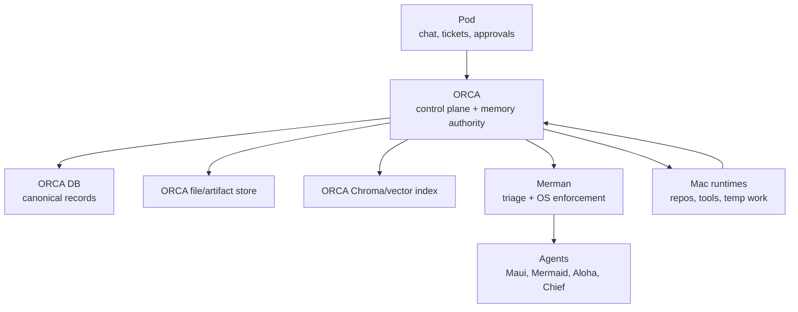
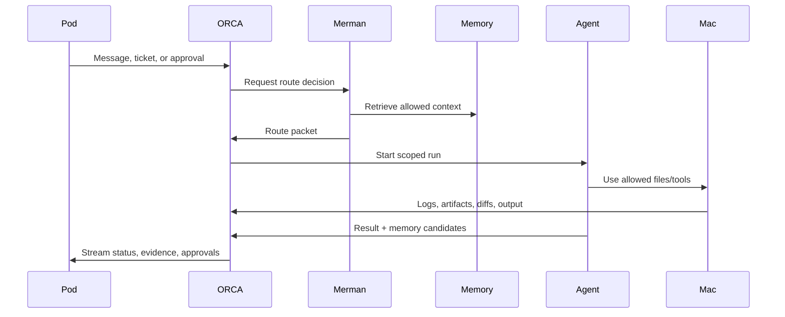

# ORCA Agent Memory, Files, Chat, And Merman Architecture

Date: 2026-05-21
Source: Maui/Pod architecture discussion
Status: Memory seed for Codex-Maui / ORCA ingestion

## North Star

ORCA should become the durable operating record for the agent system.

Pod is the human surface. Mac runtimes are execution surfaces. Agents do the work. Merman routes, triages, and enforces Schoolhouse OS policy. ORCA records, remembers, scopes, audits, and retrieves.

Core rule:

```text
ORCA is the durable brain.
Mac runtimes are the hands.
Pod is the human surface.
Merman is the router and OS enforcer.
Agents do the work.
```

## Current Mental Model



ORCA should not be only tickets. It should own tickets, logs, files, memory, projects, runs, approvals, artifacts, policy, and recall.

## Awake Lifecycle Impact

This memory architecture changes what it means for an agent to be awake.

Awake should not mean "a chat persona is responding." Awake should mean an agent has an ORCA-scoped operating context, loaded core files, current route permissions, active logs, and a place to save durable output.

Agent awake lifecycle:

```text
1. Wake request arrives
   Source can be Pod chat, ticket, schedule, watcher, runtime event, or human approval.

2. ORCA creates or resumes an awake session
   Session has id, agent id, route id, project/ticket scope, start time, and caller.

3. Merman evaluates the request
   Merman loads Schoolhouse OS, agent roster, policy, relevant memory, and current ORCA state.

4. ORCA issues a route packet
   Packet defines owner, route mode, allowed tools, workspace scope, approval gates, memory scope, and logging requirements.

5. Agent loads mandatory core files
   Agent receives only the core/project/ticket/user memory allowed by the route packet.

6. Agent starts daily/run logging
   Every awake session must append to ORCA logs and link to tickets/runs/artifacts.

7. Agent works through compute or runtime
   Simple answers can use compute. Tool/file work goes through Mac runtime and ORCA run records.

8. Agent saves outputs back to ORCA
   Notes, files, artifacts, run events, ticket updates, and memory candidates are persisted.

9. ORCA closes or idles the awake session
   Session summary, evidence, memory candidates, and follow-ups are created.
```

Awake session records should include:

```text
awake_session_id
agent_id
route_id
source: pod_chat | ticket | schedule | watchdog | human | runtime
status: waking | active | blocked | waiting_approval | idle | closed
project_id
ticket_id
workspace_id
core_bundle_version
memory_snapshot_refs
allowed_tools
approval_policy
started_at
last_heartbeat_at
closed_at
summary
```

This gives Maui continuity without faking liveness. Pod can truthfully show:

```text
Maui is awake on this ticket.
Maui is waiting on approval.
Maui is idle but has a live route.
This is a compute response, not a live awake session.
```

## Learning System

Yes, the system should learn from all of this, but learning needs a controlled pipeline.

Learning should not mean every chat, log, or file becomes permanent memory. Learning should mean ORCA can turn evidence into memory candidates, review them, approve them, index them, and make them retrievable under policy.

Learning loop:


Learning stages:

```text
raw event
  Stored as chat, run event, log, file, ticket comment, or artifact.

candidate
  Extracted possible memory with source refs and confidence.

reviewed
  Accepted, rejected, merged, or marked temporary.

approved memory
  Canonical ORCA memory record.

indexed recall
  Chroma chunk linked back to ORCA memory/file/log/ticket ids.

retrieved context
  Merman/agent receives scoped memory when relevant and allowed.
```

Learning needs negative controls:

```text
Do not learn secrets.
Do not learn noisy scratch by default.
Do not learn protected lanes without explicit visibility.
Do not learn unverified claims as facts.
Do not let Chroma recall bypass ORCA permissions.
Do not duplicate the same memory across agents.
```

## Pod Knowledge Center

The Pod Knowledge Center should become the human-facing console for ORCA knowledge and memory.

Current Pod Knowledge already has these surfaces:

```text
Chronogram
  Today's Team-Wiki/ORCA continuity document.

Wiki Mirror
  Mirrored Team-Wiki documents from ORCA.

Doctrine Bundles
  Required document bundles for agents, policies, and operating doctrine.

Doc Registry
  ORCA document registry with source, kind, owner, Chroma status, doctrine status, and required-agent metadata.

Notes And Decisions
  ORCA notes for system/project/agent/ticket/decision scopes.

Doctrine Review
  Review queue for canonical/draft/superseded/archive/quarantine actions.

Memory Candidates
  Daily-log extraction candidates and promotion review tickets.

Standards
  Standards, frameworks, playbooks, and runbooks.
```

This means the new ORCA memory architecture should not create a separate memory UI. It should extend Knowledge Center.

Recommended Knowledge Center tabs/sections:

```text
Today
  Chronogram, awake agents, daily logs, current memory candidates.

Doctrine
  Core files, Schoolhouse OS, Merman router, agent core bundles, required docs.

Memory
  Candidate, approved, rejected, archived memory by lane.

Research
  Sources, claims, citations, open questions, research notes.

Files
  ORCA file system browser, artifacts, generated files, uploads.

Registry
  Doc registry, Chroma status, doctrine status, owner, required-agent coverage.

Review
  Promotion queue, doctrine queue, storage hygiene, protected lane approvals.
```

Knowledge Center should answer:

```text
What does the system know?
Where did it learn that?
Who approved it?
Which agents can see it?
Is it indexed for recall?
Which core files are required for wake?
What changed today?
What needs review?
```

## Storage Design

ORCA needs three main storage layers:

```text
1. ORCA DB
   Source of truth for tickets, projects, memory records, permissions, approvals, runs, logs, and audit history.

2. ORCA file/artifact store
   Stores agent-created files, generated outputs, screenshots, PDFs, exports, attachments, source uploads, and evidence.

3. ORCA Chroma/vector index
   Semantic recall layer for approved or useful text: memory, summaries, research, decisions, ticket notes, project notes, and source summaries.
```

Chroma should not be the source of truth. Chroma is the recall engine.

```text
ORCA answers:
  Is this approved, current, allowed, and canonical?

Chroma answers:
  What is semantically related to this?
```

## ORCA File System

Agents should save durable files into ORCA, not randomly onto the Mac.

Possible ORCA paths:

```text
orca://agents/maui/core/
orca://agents/maui/notes/
orca://projects/pod/files/
orca://tickets/POD-123/artifacts/
orca://tickets/POD-123/notes/
orca://runs/RUN-456/scratch/
orca://research/pod-chat/sources/
orca://logs/daily/2026-05-21/maui.md
```

Agents can still use the Mac runtime for local repo work, builds, tools, and temporary run folders. Anything durable should be pushed back into ORCA.

## Memory Lanes

Memory should be first-class inside ORCA, with scoped lanes:

```text
core
  Schoolhouse OS, Merman routing rules, agent identities, protected policies

user
  durable preferences, operating style, human instructions

project
  architecture decisions, app context, conventions, active priorities

research
  source-backed notes, claims, summaries, open questions, citations

ticket
  temporary task context, acceptance, findings, evidence, decisions

decision
  canonical choices and why they were made

agent
  agent-specific working memory, capabilities, habits, known context
```

Each memory record should have metadata:

```text
memory_id
type
scope
status: candidate | approved | rejected | archived
visibility: all_agents | selected_agents | human_only | protected
source_refs
confidence
created_by
approved_by
created_at
last_used_at
expires_at
```

## Document Types

The system needs an explicit document taxonomy so ORCA can classify, review, index, and retrieve correctly.

Recommended document types:

```text
core_file
  Mandatory identity, policy, and operating files loaded before agent wake.

standard
  Stable rule or expectation. Usually applies broadly.

framework
  Conceptual structure for how work is organized.

playbook
  Repeatable procedure for a known workflow.

runbook
  Operational steps for a technical or runtime process.

charter
  Purpose, authority, boundaries, and ownership for an agent/project/system.

policy
  Permission, approval, safety, security, memory, or tool-use rule.

route_packet
  Merman-produced routing decision for a request/run.

daily_log
  Structured daily continuity record from an agent.

run_log
  Event log for a specific agent run or compute/tool execution.

ticket_record
  ORCA ticket state, acceptance, outcome, comments, approvals, and evidence.

project_note
  Project-specific context, decisions, risks, conventions, or summaries.

research_source
  Raw source material: URL, PDF, transcript, upload, web page, or document.

research_note
  Agent/human summary or observation about research.

claim
  Source-backed reusable fact with citation and confidence.

decision
  Canonical choice with rationale, date, owner, and source refs.

artifact
  Generated output, screenshot, export, diff, report, or evidence file.

memory_candidate
  Extracted possible memory awaiting review.

approved_memory
  Canonical memory record approved for scoped retrieval.

audit_record
  Immutable record of who changed what, when, and why.

watchdog_finding
  Storage, policy, logging, indexing, or runtime drift finding.
```

Mapping to current Pod Knowledge:

```text
Standards tab/model:
  standard, framework, playbook, runbook

Doc Registry:
  all document types, plus source/kind/owner/chroma/doctrine status

Doctrine Bundles:
  core_file, charter, policy, standard, playbook, runbook grouped by agent/system

Notes And Decisions:
  decision, project_note, system note, agent note, ticket note

Memory Candidates:
  memory_candidate extracted from daily_log/run_log/ticket/chat

Wiki Mirror:
  mirrored source docs, chronograms, doctrine, research, historical notes
```

Each document should have:

```text
doc_id
kind
title
source
path_or_uri
owner
scope
status: draft | candidate | canonical | superseded | archived | quarantined
visibility
required_for_agents
enforced_by
chroma_status
last_indexed_at
source_refs
created_at
updated_at
```

## Research Memory

Research should have its own lane.

```text
Research Memory
  raw sources
  research notes
  claims
  citations
  decisions
  open questions
```

Raw research should stay as artifacts/evidence. Summaries and claims can become memory candidates. Only reviewed, useful findings should become durable project or decision memory.

## Daily Logs

Daily logs should be mandatory for agents, but structured.

```text
Daily Agent Log
  date
  agent
  projects touched
  tickets touched
  work completed
  decisions made
  blockers
  files/artifacts created
  memory candidates
  follow-ups
```

Agents can write extra notes, but ORCA should normalize them through a sweep process.

Core rule:

```text
Agents can write messy.
ORCA must store clean.
```

## ORCA Sweep

ORCA should run a sweep that reviews logs, files, tickets, and memory candidates.

Sweep jobs:

```text
deduplicate
classify
summarize
promote memory candidates
archive raw notes
index approved recall into Chroma
flag policy violations
detect missing logs
detect orphaned artifacts
```

## Watchdogs

A watchdog should review Mac/runtime and ORCA consistency.

It should check:

```text
Did an agent create files outside approved folders?
Did a run produce artifacts not uploaded to ORCA?
Did a ticket close without summary/evidence?
Did an agent add memory without source refs?
Did daily logs fail?
Did Chroma miss approved memory?
Did protected/private material get indexed accidentally?
```

Main rule:

```text
If it matters, it must be in ORCA.
If it is in ORCA and allowed for recall, it should be indexed.
If it is outside ORCA, it is temporary or a policy exception.
```

## Merman's Role

Merman is not the worker. Merman is the triage, router, and Schoolhouse OS enforcement layer.

Before serious work starts, Merman should load:

```text
Schoolhouse OS core rules
routing charter
agent roster
tool policy
approval policy
workspace map
memory policy
protected lanes
current ORCA/ticket context
relevant project/user memory
```

Merman then produces a route packet:

```text
owner_agent
route_mode: chat | compute | ticket | agent_run | approval
workspace_scope
allowed_tools
approval_required
memory_context
ticket_context
risk_level
why_this_route
```

That packet tells ORCA and the selected agent what is allowed.

## Agent Activation Flow



The selected agent becomes active only after Merman routes the request and ORCA scopes the work.

## Chat, Routing, And Tickets

Pod chat is a surface. It should not pretend every message is directly a live agent.

The flow should be:

```text
Pod chat receives message
Merman classifies intent
ORCA chooses route
Agent or compute responds
Ticket/run is created if needed
Artifacts/logs/memory are saved back to ORCA
```

Simple chat can be compute-backed. Serious work should become an ORCA run or ticket.

```text
Simple question:
  Pod -> Merman -> compute -> response

Work request:
  Pod -> Merman -> ORCA ticket/run -> agent -> Mac runtime -> evidence -> Pod

Protected request:
  Pod -> Merman -> approval -> agent/run only after approval
```

## Compute Routes

Compute is a route, not the whole agent.

Possible compute routes:

```text
Spark
Kimi
other API-backed models
```

Claude/Codex subscription surfaces are different from ordinary API-backed compute routes unless there is an approved API/runtime path. Schoolhouse should treat compute providers as pluggable backends, while Codex/Mac runtimes are execution surfaces.

## Mac Runtime

The Mac should hold:

```text
checked-out repos
workspace folders
temporary run folders
tool caches
build output
local logs before upload
```

The Mac should not become the memory source.

Preferred local shape:

```text
/SchoolhouseRuntime/
  workspaces/
  runs/
    RUN-123/
      scratch/
      outputs/
      logs/
  cache/
  inbox/
```

Anything durable goes to ORCA.

## Current Pod Chat State

Current Pod chat has moved toward honest routing, but it is not yet true Claude/Codex-like live-agent continuity.

Known current pieces:

```text
DirectChat is the active chat surface.
Agent registry is loaded from ORCA.
ORCA direct channels are discovered and streamed.
Messages can route through compute/live inbox/auto.
Merman triage preview exists.
Chat can attach/create tickets.
Ticket continuity is shown in chat.
Local SwiftData stores conversations/messages.
SSE and polling are used for live channel messages.
```

Key limitation:

```text
Compute-backed replies currently behave like scoped chat responses.
They do not yet directly read files, run tools, mutate ORCA, update memory, or produce full agent-run evidence unless a backend route implements that.
```

## Gaps To Close

The main gaps from the full discussion:

```text
1. ORCA memory is not yet a first-class product surface.
2. ORCA file/artifact storage needs clear API and path semantics.
3. Chroma should be owned by ORCA and tied to ORCA ids, not agent-private indexes.
4. Merman route packets need a stable schema and backend enforcement.
5. Agents need mandatory core files hosted in ORCA.
6. Agents need mandatory daily logs.
7. Agents need an ORCA-backed file save path.
8. Mac runtimes need approved run/workspace directories and cleanup rules.
9. Watchdogs need to detect files created outside ORCA/runtime policy.
10. ORCA sweep needs to promote/dedupe/archive/index memory candidates.
11. Pod needs UI for memory candidates, files, logs, route decisions, and approvals.
12. Tickets need first-class done-means/acceptance/outcome fields, not only markdown.
13. Chat needs clear delivery state and should not fake live-agent replies.
14. Agent runs need tool events, artifact events, file events, approvals, and final evidence.
15. Research memory needs source refs, claims, confidence, and decision links.
16. Protected lanes need visibility and indexing controls.
17. Memory retrieval should be scoped by project, ticket, agent, visibility, and policy.
18. Closed tickets should generate summaries and memory candidates.
19. There should be a source-of-truth audit trail for who wrote/approved memory.
20. ORCA should expose a simple recall API to all agents.
```

## Ideas Captured From The Full Discussion

This document should preserve these ideas from the broader Pod/Maui discussion:

```text
Pod chat is a surface, not the router.
Merman is the triage/router/Schoolhouse OS enforcement layer, not the worker.
Tickets are durable work containers with autonomy, approval, evidence, and acceptance.
Compute routes can include Spark, Kimi, and other API-backed models.
Claude/Codex-style surfaces are different from plain compute APIs unless routed through an approved runtime.
Agents should not fake live replies.
Chat should show delivery state: compute, live inbox, agent run, waiting, failed, approval required.
Serious work should route through ORCA tickets/runs, not invisible chat-only actions.
Merman should load core files before deciding route.
The selected agent should load its own core files after route and scope are known.
ORCA should own shared memory and Chroma, with permissioned views per agent.
Research memory should be its own lane, with sources, claims, citations, decisions, and open questions.
Daily logs should become a mandatory learning input.
The Pod Knowledge Center should become the review console for doctrine, docs, memory, and learning.
Mac runtimes should execute work but not become the durable memory/file home.
Agents should save durable files, notes, logs, and memory candidates into ORCA.
Watchdogs should find files/logs/artifacts created outside policy.
ORCA sweep should dedupe, classify, promote, archive, and index.
Awake should mean an ORCA-scoped active agent session, not just a chat persona.
Maui should be able to reuse shared ORCA memory without duplicates.
```

## Open Decisions

These are the questions still worth deciding before implementation:

```text
1. What is the exact ORCA storage backend for files?
   Options: local disk managed by ORCA, S3-compatible object storage, database blobs for small files, or hybrid.

2. What is the exact memory approval model?
   Which lanes require Tony approval, Maui approval, Merman approval, or automatic promotion?

3. What is the first version of the Merman route packet schema?
   The document proposes fields, but the backend contract needs to be finalized.

4. What counts as an awake session?
   Does every compute reply create a lightweight session, or only routed agent/ticket work?

5. What is the first supported agent file API?
   Example: save_note, upload_artifact, append_log, create_memory_candidate, read_orca_file.

6. What is the Chroma indexing policy?
   Which document kinds index immediately, which require review, and which are never indexed?

7. How should protected lanes work?
   Chief/Fund, identity, archive, credentials, and durable memory need explicit visibility and approval rules.

8. What is the lifecycle for daily logs?
   When are they generated, who reviews them, how long raw logs remain, and when candidates are promoted?

9. How should Pod expose memory review?
   Extend the existing Knowledge Center or add dedicated subviews for Memory, Files, Awake Sessions, and Review.

10. What runtime folders are allowed on the Mac?
   Need a concrete /SchoolhouseRuntime policy and watchdog rules.

11. What are the first autonomous ticket capabilities?
   Need to define which ticket types Mermaid/Merman can complete without human approval.

12. What does done mean for ticket autonomy?
   Need first-class acceptance, outcome, evidence, and approval fields, not only markdown.
```

## V1 Design Direction

These are the recommended first decisions so the system can start simple and grow safely.

Core principle:

```text
Everything starts as scoped, logged, and reviewable.
Autonomy grows by lane after evidence.
Agents may act, but ORCA must know what happened.
```

### ORCA File Backend V1

Use a hybrid local-first file backend.

```text
Store file bytes under an ORCA-managed local directory.
Store metadata, ownership, scope, permissions, and source refs in ORCA DB.
Expose stable orca:// paths to agents and Pod.
Design the abstraction so file bytes can move to S3/object storage later.
```

V1 should not let agents save durable files directly to random Mac paths. The Mac remains the runtime/workbench.

### Memory Approval V1

Default all new learned memory to candidate status.

```text
candidate by default:
  daily log observations
  project notes
  ticket summaries
  research notes
  agent observations

approval required:
  user memory
  identity/core memory
  protected lanes
  archive/delete decisions
  Chief/Fund/trading context
  credentials/security context
  durable policy changes
```

Low-risk sourced project summaries can be promoted with Maui/Merman review. Human approval should be required for durable user memory, protected lanes, identity, credentials, archive, and trading/money-related state.

### Merman Route Packet V1

Keep the first route packet small and strict.

```text
route_id
owner_agent
mode: chat | compute | ticket | agent_run | approval
project_id
ticket_id
workspace_id
allowed_tools
approval_required
memory_scope
file_scope
reason
risk_level
created_at
```

This packet should be saved in ORCA and linked to the chat message, ticket, run, awake session, and logs.

### Awake V1

Awake means ORCA has an active agent session.

```text
Compute-only replies:
  lightweight interaction; no full awake session required unless memory/files/tools/tickets are touched.

Agent work:
  creates or resumes an awake session.

Ticket work:
  creates or resumes an awake session.

File/tool/memory writes:
  always require an awake session and logs.
```

Pod should show this truthfully:

```text
compute response
agent awake
waiting for approval
live inbox
agent run active
agent run complete
```

### Chroma Indexing V1

ORCA owns Chroma. Every Chroma chunk must point back to an ORCA id.

Index by default:

```text
approved memory
decisions
project summaries
research notes
ticket summaries
approved source summaries
canonical standards/playbooks/runbooks
```

Index separately or behind review:

```text
candidate memory
daily log extracts
raw research summaries
agent observations
```

Never index by default:

```text
secrets
credentials
protected lanes
human-only notes
raw noisy logs
failed scratch work
private identity/core changes awaiting approval
```

### Protected Lanes V1

Start explicit and conservative.

```text
Chief/Fund/trading
credentials
security
identity/core files
archive/delete
durable user memory
external sends/actions
money or account actions
```

Protected lanes require approval before mutation. They can allow read-only summaries only when Merman/ORCA confirms scope and visibility.

### Autonomous Tickets V1

V1 autonomy can do low-risk preparation and evidence work.

Allowed without human approval when scoped:

```text
classify
summarize
draft
triage
gather evidence
propose fix
create notes
prepare ticket output
prepare PR description
create memory candidates
```

Approval required before:

```text
destructive edits
protected memory changes
external communications
money/trading actions
credential/security changes
archive/delete actions
identity/core file changes
```

## V1 Build Order

Recommended implementation order:

```text
1. ORCA record schemas
   memory, file/artifact, awake session, route packet, log entry.

2. Merman route packet V1
   every chat/ticket/run gets a route decision.

3. ORCA file store V1
   local ORCA-managed storage with stable orca:// paths.

4. Daily logs and awake sessions
   durable work requires logging.

5. Memory candidate pipeline
   save candidates, review/promote/reject, then index.

6. Chroma owned by ORCA
   every vector chunk points back to an ORCA id.

7. Pod Knowledge Center upgrades
   show memory candidates, approved memory, files, route packets, awake sessions.
```

## Better AgentChatService Direction

The current chat service can be split into clearer backend services over time:

```text
DirectChatService
  message send, channel list, channel stream, history

TriageService
  Merman preview, route packet, policy decision

AgentRunService
  create run, stream run events, approve tool calls, fetch artifacts

WorkspaceService
  list/search workspaces, attach files, read snapshots

MemoryService
  query recall, create candidate, approve/reject, index state

ArtifactService
  upload, link to ticket/run/project, summarize/index
```

## Best Near-Term Build Path

```text
1. Add ORCA memory records.
2. Add ORCA file/artifact storage.
3. Add Chroma indexing tied to ORCA memory/file ids.
4. Add mandatory daily logs.
5. Add Merman route packets.
6. Add agent run records.
7. Add watchdog checks.
8. Add Pod UI for memory, files, logs, approvals, and ticket evidence.
9. Add retrieval so agents receive scoped memory from ORCA.
10. Add sweep jobs to promote, archive, dedupe, and index.
```

## Agent Lenses

One shared memory system, many permissioned lenses:

```text
Merman sees routing/policy memory.
Maui sees project/user/decision memory.
Mermaid sees ticket/work context.
Aloha sees allowed chat/project context.
Chief sees protected lanes only when allowed.
```

Agents should not each build separate private memory piles. They should all request memory through ORCA, and ORCA should decide what they are allowed to see.

## Acceptance For This Architecture

This architecture is healthy when:

```text
An agent can save durable data without writing random files to the Mac.
Every useful file/log/memory item has an ORCA id.
Every indexed Chroma chunk points back to an ORCA record.
Merman can explain why a route was chosen.
Pod can show whether a reply is compute, live inbox, or agent run.
Tickets contain evidence and acceptance, not just conversation.
Daily logs can be swept into memory candidates.
Watchdogs can find policy drift.
Protected data is not accidentally recalled by unauthorized agents.
Maui can reuse this memory without duplicates.
```
